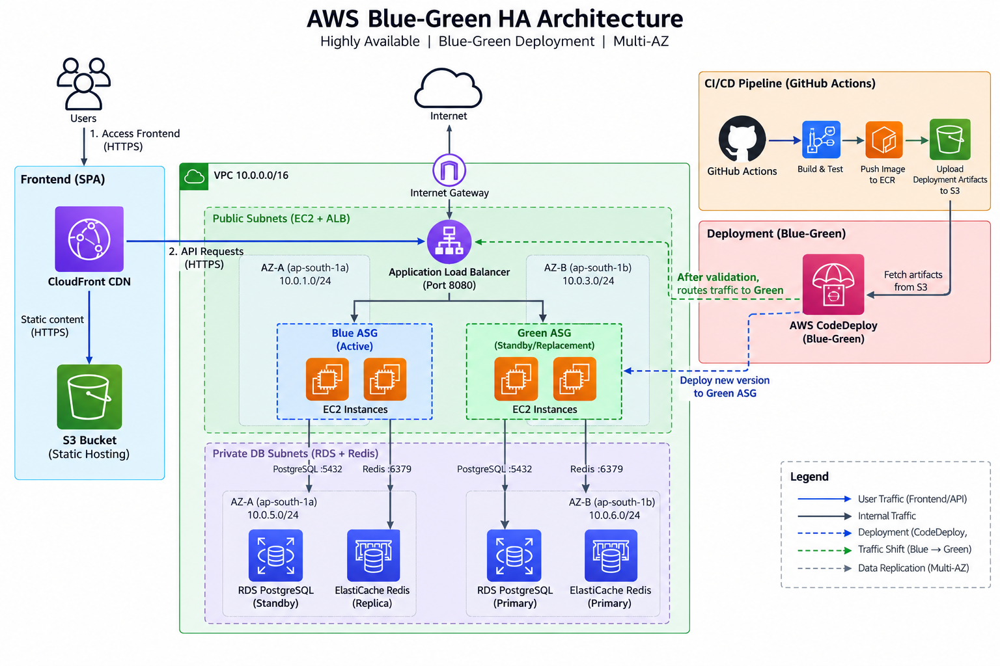

# BlueGreen-HA: Highly Available Blue/Green Architecture on AWS

Production-grade, highly available AWS architecture featuring automated, zero-downtime Blue/Green deployments across multiple Availability Zones (`ap-south-1`). Built to demonstrate enterprise-grade session persistence, automated schema evolution (Expand/Contract pattern), and automated rollback capabilities.

---

## Architecture Diagram



---

## Architectural Highlights

- **Zero-Downtime Deployments**: AWS CodeDeploy executes automated Blue/Green deployments by provisioning a replacement Auto Scaling Group (Green fleet), validating target health, shifting Application Load Balancer traffic, and terminating the previous (Blue) instances after a 5-minute soak window.
- **Session & State Persistence**: All user shopping carts and active sessions are decoupled from EC2 compute and persisted in Amazon ElastiCache (Redis 7.1) with Multi-AZ automatic failover. Traffic cutovers between Blue and Green fleets preserve cart state with zero session drops.
- **Zero-Downtime Schema Evolution**: Database changes utilize Flyway-managed schema migrations following the Expand/Contract pattern. Additive, backward-compatible migrations run prior to application container cutovers so that active Blue and incoming Green containers execute concurrently against Amazon RDS PostgreSQL without transaction locks or errors.
- **Multi-AZ Fault Tolerance**: Infrastructure is distributed across two Availability Zones (`ap-south-1a` and `ap-south-1b`). Compute instances scale dynamically across public subnets, while RDS PostgreSQL operates with synchronous multi-AZ standby replication and ElastiCache Redis operates with asynchronous multi-node replica auto-failover in private subnets.
- **Edge Acceleration & Security**: Static Single Page Application (SPA) assets are hosted on private Amazon S3 buckets protected by CloudFront Origin Access Control (OAC) and served over TLS 1.2 via Amazon CloudFront.

---

## System Architecture & Component Breakdown

### 1. Edge & Frontend Layer
- **Amazon CloudFront**: Global CDN terminating HTTPS (TLS 1.2) with Origin Access Control (OAC), serving client single-page assets.
- **Amazon S3 (Frontend Bucket)**: Private S3 bucket storing production React / Vite build artifacts, blocked from public read access.

### 2. Networking Layer (VPC `10.0.0.0/16`)
- **Public Subnets**:
  - `Public Subnet 1` (`10.0.1.0/24`, `ap-south-1a`)
  - `Public Subnet 2` (`10.0.3.0/24`, `ap-south-1b`)
  - Connected to Internet Gateway (IGW) for ALB ingress and outbound package retrieval.
- **Private Database Subnets**:
  - `Private DB Subnet 1` (`10.0.5.0/24`, `ap-south-1a`)
  - `Private DB Subnet 2` (`10.0.6.0/24`, `ap-south-1b`)
  - Isolated from direct internet access; reachable only from backend compute security groups over ports 5432 (PostgreSQL) and 6379 (Redis).

### 3. Traffic Routing & Compute Tier
- **Application Load Balancer (ALB)**: Public-facing ALB routing inbound HTTP (port 80) requests to the active target group (`bluegreen-ha-tg-blue`).
- **Auto Scaling Group (ASG)**: EC2 Auto Scaling Group running Amazon Linux 2023 (`t3.micro`) across AZs with Min: 1, Desired: 2, Max: 4 instances.
- **Launch Template**: Provisions EC2 instances with Docker, Ruby, and AWS CodeDeploy Agent initialized via user-data.
- **Backend Service**: Containerized Node.js/Express service exposing port 8080.

### 4. Persistence & Caching Tier
- **Amazon RDS PostgreSQL (v15)**: Multi-AZ PostgreSQL database (`db.t3.micro`) configured with synchronous replication to an automatic standby replica in `ap-south-1b`.
- **Amazon ElastiCache (Redis v7.1)**: Multi-AZ replication group (`cache.t3.micro`) with automatic failover enabled across 2 nodes. Manages distributed session storage (`connect-redis`) and IP-based checkout rate limiting.

### 5. Deployment & Configuration Management
- **AWS CodeDeploy**: Orchestrates traffic shifts using `CodeDeployDefault.AllAtOnce` deployment configuration with `COPY_AUTO_SCALING_GROUP` green fleet provisioning and automated traffic shifting.
- **AWS Systems Manager (SSM) Parameter Store**: Stores runtime configuration securely:
  - `/bluegreen/database_url`: PostgreSQL connection string with SSL configuration.
  - `/bluegreen/redis_url`: Primary endpoint for ElastiCache Redis cluster.
- **Amazon ECR**: Private container registry (`bluegreen-ha-backend`) storing version-tagged container images.
- **Amazon CloudWatch Logs**: Centralized log group (`/ecs/bluegreen-ha-backend`) retaining operational and deployment logs.

---

## Technical Stack

| Layer | Technology | Description |
| :--- | :--- | :--- |
| **Frontend** | React 18, Vite | Single Page Application with live polling health widget and cart persistence |
| **Backend API** | Node.js, Express, Docker | Stateless REST API interfacing with PostgreSQL and Redis |
| **Session Store** | Redis 7.1, `connect-redis` | Multi-AZ distributed session state and checkout rate limiting |
| **Relational Database** | PostgreSQL 15 | Multi-AZ transactional order storage |
| **Database Migrations** | Flyway 9 | Versioned, forward-compatible schema evolution scripts |
| **Infrastructure as Code** | Terraform (AWS Provider ~> 5.0) | Declarative multi-AZ infrastructure provisioning |
| **CI/CD** | GitHub Actions | Automated build, test, container push, and CodeDeploy triggers |
| **Deployment Orchestration**| AWS CodeDeploy, S3, ECR | Blue/Green fleet management, health checks, and traffic cutovers |

---

## API Reference

The backend exposes the following endpoints on port `8080`:

| Method | Route | Description | Expected Status |
| :--- | :--- | :--- | :--- |
| `GET` | `/health` | Target group health probe returning PostgreSQL, Redis, and version status | `200 OK` / `503 Service Unavailable` |
| `GET` | `/test/smoke` | CodeDeploy lifecycle smoke test verifying read/write against DB and Redis | `200 OK` |
| `GET` | `/info` | Hostname and running application version identifier | `200 OK` |
| `GET` | `/products` | Retrieves product catalog and stock levels | `200 OK` |
| `GET` | `/cart` | Retrieves current session cart from Redis | `200 OK` |
| `POST` | `/cart` | Appends item to cart with stock validation | `200 OK` / `400 Bad Request` |
| `PUT` | `/cart/:id` | Updates quantity of specific item in cart | `200 OK` / `400 Bad Request` |
| `POST` | `/cart/:id/increment` | Increments cart item quantity | `200 OK` / `400 Bad Request` |
| `POST` | `/cart/:id/decrement` | Decrements cart item quantity | `200 OK` / `404 Not Found` |
| `DELETE`| `/cart` | Flushes session cart state | `200 OK` |
| `POST` | `/api/orders` | Rate-limited order placement transaction (`orders` table insert) | `200 OK` / `429 Too Many Requests` |

### Sample Health Check Response (`GET /health`)
```json
{
  "status": "ok",
  "db": "connected",
  "redis": "connected",
  "version": "V2",
  "hostname": "ip-10-0-1-42.ap-south-1.compute.internal"
}
```

---

## Blue/Green Deployment Lifecycle

```
[Git Commit / PR Merge]
           │
           ▼
[GitHub Actions Workflow]
   ├─ 1. Build and tag Docker image with commit SHA
   ├─ 2. Push container image to Amazon ECR
   ├─ 3. Run Flyway schema migrations (Expand Phase)
   ├─ 4. Package appspec.yml, scripts, and deploy.env
   └─ 5. Upload deployment bundle to S3 & trigger CodeDeploy
           │
           ▼
[AWS CodeDeploy Orchestrator]
   ├─ 1. Clone ASG to create Green Fleet (EC2 instances)
   ├─ 2. Pull container from ECR and launch on Green instances
   ├─ 3. Execute BeforeInstall, AfterInstall, ApplicationStart hooks
   ├─ 4. Run /test/smoke verification tests on Green instances
   ├─ 5. Shift ALB traffic from Blue Target Group to Green Target Group
   └─ 6. Soak 5 minutes -> Terminate original Blue Fleet instances
```

---

## Repository Structure

```
├── .github/
│   └── workflows/
│       ├── backend.yml           # Backend CI/CD: Docker build, ECR push, CodeDeploy
│       └── frontend.yml          # Frontend CI/CD: S3 sync and CloudFront invalidation
├── appspec.yml                   # AWS CodeDeploy deployment lifecycle specification
├── backend/
│   ├── Dockerfile                # Backend container definition
│   ├── index.js                  # Express API, Redis session store, PostgreSQL pool
│   ├── package.json              # Backend dependencies
│   └── scripts/
│       ├── before_install.sh     # Cleanup script for previous deployments
│       ├── migrate_db.sh         # Flyway migration executor inside EC2 hook
│       ├── start_server.sh       # Fetches SSM params, pulls image, starts container
│       └── stop_server.sh        # Stops running backend container
├── diagram/
│   ├── architecture_diagram.png  # Generated diagrams export
│   ├── final_diagram.png         # High-resolution production architecture diagram
│   └── generate_architecture.py  # Python diagrams code generating architecture assets
├── docker-compose.yml            # Local development orchestration
├── frontend/
│   ├── Dockerfile                # Nginx multi-stage build for local testing
│   ├── index.html                # Entrypoint HTML
│   ├── package.json              # Frontend dependencies
│   └── src/
│       ├── App.jsx               # React SPA with version banner and live polling
│       ├── index.css             # Styling rules
│       └── main.jsx              # React DOM initialization
├── migrations/
│   ├── V1__initial_schema.sql    # Base orders and products schema
│   ├── V2__add_cod_column.sql    # Schema evolution: Cash-on-Delivery payment method
│   └── V3__add_inventory_and_orders.sql # Inventory tracking & sample catalog
└── terraform/
    ├── alb.tf                    # Application Load Balancer and Target Groups
    ├── cloudwatch.tf             # CloudWatch Log Group definition
    ├── codedeploy.tf             # CodeDeploy Application and Deployment Group
    ├── compute.tf                # Launch Template and Auto Scaling Group
    ├── ecr.tf                    # Amazon ECR repository definition
    ├── elasticache.tf            # Redis Multi-AZ replication group
    ├── iam.tf                    # IAM roles and instance profiles for EC2/CodeDeploy
    ├── main.tf                   # Terraform AWS provider setup
    ├── outputs.tf                # Infrastructure output values
    ├── rds.tf                    # Multi-AZ PostgreSQL RDS instance
    ├── s3_cloudfront.tf          # Frontend S3 bucket and CloudFront CDN distribution
    ├── security_groups.tf        # Security groups for ALB, Backend, RDS, Redis
    ├── ssm.tf                    # Parameter Store configuration values
    ├── variables.tf              # Region and project configuration variables
    └── vpc.tf                    # VPC, subnets, route tables, Internet Gateway
```

---

## Local Development Setup

Run the full local environment including PostgreSQL, Redis, Flyway migrations, Backend API, and Frontend:

```bash
# 1. Clone repository
git clone https://github.com/<your-org>/BlueGreen-HA.git
cd BlueGreen-HA

# 2. Launch all services via Docker Compose
docker compose up --build
```

### Local Endpoints

- **Frontend Application**: `http://localhost:80`
- **Backend API**: `http://localhost:8080`
- **PostgreSQL Database**: `localhost:5433` (User: `postgres`, Password: `postgres`, DB: `postgres`)
- **Redis Cache**: `localhost:6379`

---

## Production Deployment Guide

### Prerequisites
- [AWS CLI v2](https://aws.amazon.com/cli/) configured with administrative credentials.
- [Terraform >= 1.5.0](https://developer.hashicorp.com/terraform/downloads) installed.
- Docker engine running locally (if testing builds).

### Step 1: Provision Infrastructure via Terraform

```bash
cd terraform

# Initialize providers and remote state
terraform init

# Validate configuration
terraform plan -out=tfplan

# Apply infrastructure changes
terraform apply tfplan
```

Record key outputs from Terraform:
```bash
terraform output
```

### Step 2: Configure GitHub Repository Secrets

Configure the following secrets in GitHub Repository Settings (`Settings -> Secrets and variables -> Actions`):

| Secret Name | Source / Description |
| :--- | :--- |
| `AWS_ACCESS_KEY_ID` | IAM deployment user access key |
| `AWS_SECRET_ACCESS_KEY` | IAM deployment user secret key |
| `AWS_REGION` | Target region (`ap-south-1`) |
| `ECR_REPOSITORY` | `bluegreen-ha-backend` (from Terraform output `ecr_repository_name`) |
| `CODEDEPLOY_BUCKET` | S3 bucket for bundles (from Terraform output `codedeploy_bucket`) |
| `CODEDEPLOY_APP_NAME` | `bluegreen-ha-backend-app` (from Terraform output `codedeploy_app_name`) |
| `CODEDEPLOY_DEPLOYMENT_GROUP` | `bluegreen-ha-backend-dg` (from Terraform output `codedeploy_deployment_group`) |
| `S3_BUCKET_NAME` | Frontend S3 bucket name (from Terraform output `frontend_bucket_name`) |
| `CLOUDFRONT_DISTRIBUTION_ID` | CloudFront ID (from Terraform output `cloudfront_distribution_id`) |
| `VITE_BACKEND_URL` | Application Load Balancer endpoint (e.g. `http://<alb_dns_name>`) |

### Step 3: Trigger Automated Deployments

- **Frontend Changes**: Pushing changes to `frontend/**` automatically triggers `.github/workflows/frontend.yml`, compiling Vite assets, uploading to S3, and issuing a wildcard `/*` CloudFront cache invalidation.
- **Backend Changes**: Pushing changes to `backend/**`, `appspec.yml`, or database migrations triggers `.github/workflows/backend.yml`, building the container, uploading to ECR, creating a CodeDeploy revision in S3, and executing the Blue/Green shift.

---

## Rollback & Failure Recovery

1. **Pre-Traffic Cutover Failures**: If newly provisioned Green instances fail `/health` target group probes or fail `/test/smoke` lifecycle scripts, AWS CodeDeploy aborts the deployment immediately without rerouting production traffic. The active Blue fleet remains untouched.
2. **Post-Traffic Cutover Rollback**: In the event of application anomalies detected during the 5-minute termination soak period, CodeDeploy can execute an instant one-click rollback to re-point ALB listener rules back to the original Blue Target Group.
3. **Database Safety**: Database migrations follow the Expand/Contract paradigm. Schema changes are additive (new optional columns or tables with default values), ensuring that rollbacks to previous application versions can run against the updated database schema without schema reversion.
